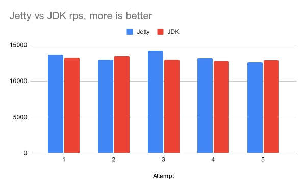

# Ring JDK Adapter

Ring JDK Adapter is a small wrapper on top of the built-in `jdk.httpserver` HTTP
server available in Java. It's like Jetty but has no dependencies. It's almost
as fast as Jetty, too (see benchmars below).

## Why

Sometimes you'd like to run a local HTTP server in Clojure, e.g. for testing or
mocking purposes. There is a number of adapters for Ring, and all of them rely
on third party servers like Jetty, Undertow, etc. To run them, you have to
download plenty of dependencies. This is tolerable to some extend, yet sometimes
you really want something quick and simple.

Since version 9 or 11 (I don't remember for sure), Java ships it's own HTTP
server. The package name is `com.sun.net.httpserver` and the module name is
`jdk.httpserver`. This library provides an adapter that serves Ring
handles. It's completely free from any dependencies.

Ring JDK Adapter is a great choice for local HTTP stubs, or mock services that
mimic HTTP services. Despite some people think it's for development purposes
only, the server is pretty fast! One can use it even in production.

## Installation

~~~clojure
;; lein
[com.github.igrishaev/ring-jdk-adapter "0.1.0-SNAPSHOT"]

;; deps
com.github.igrishaev/ring-jdk-adapter {:mvn/version "0.1.0-SNAPSHOT"}
~~~

## Quick Demo

## Parameters

## Benchmarks

Ivan Grishaev, 2024
